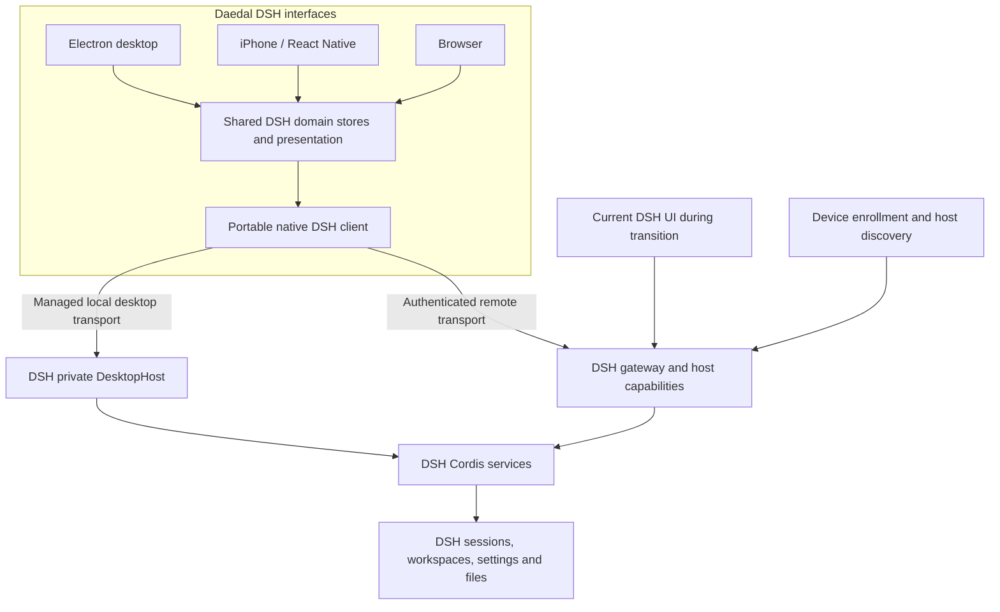

# Daedal DSH migration plan

Status: approved for implementation by Carlo on 15 September 2026. This document describes the migration; the accepted specifications in `.specs/` hold its durable requirements. Completion requires the recorded acceptance evidence for each work package.

Daedal DSH will become the primary desktop, iPhone, and web interface for DeepSeek Harness. It will use the daedal-one identity and control the same DSH sessions across devices. The existing DSH UI remains available throughout migration and until the replacement passes the agreed parity and recovery gates.

The architectural recommendation is to keep Paseo's cross-platform presentation and desktop shell, replace its agent-management domain with DSH's native client APIs, and reuse DSH's existing desktop runtime architecture. A branded desktop preview can ship early through the existing bridge. The completed product must not depend on a second agent engine or a permanent translation of DSH events into Paseo events.

## 1. Decisions and scope

| Decision                 | Proposed treatment                                                                                                                                                       |
| ------------------------ | ------------------------------------------------------------------------------------------------------------------------------------------------------------------------ |
| Product name             | **Daedal DSH**, confirmed by Carlo. Use the company logo assets rather than creating a replacement mark.                                                                 |
| Product role             | Primary DSH desktop, mobile, and web interface, confirmed by Carlo; retain the current UI during migration.                                                              |
| Backend authority        | DSH owns execution, durable sessions, workspaces, permissions, configuration, and host operations.                                                                       |
| Supported models         | Models and providers exposed by DSH remain available. DSH-specific does not mean DeepSeek-model-only.                                                                    |
| First platforms          | macOS and the existing iPhone installation first; browser support shares the native integration milestones. Other supported platforms have separate qualification gates. |
| First connection         | Attach to an existing DSH host. Keep the accepted one-time QR pairing followed by host-assisted Tailscale discovery.                                                     |
| Managed local runtime    | Add an optional DSH-owned desktop runtime after native connectivity works. Reuse the existing DSH DesktopHost installation and lifecycle contracts.                      |
| iOS application identity | Preserve the existing bundle identifier, Apple team, and Expo project so TestFlight updates replace the installed companion. Change the displayed name and assets.       |
| Repository               | Continue in `daedal-one/paseo`, retaining `getpaseo/paseo` as upstream. A repository rename is unnecessary for the product migration.                                    |
| Development governance   | Forge Spec owns intent; Forge Intellect retains attributable planning and implementation evidence. Neither becomes a required service for ordinary end-user chat.        |

The migration includes sessions, rich tool output, approvals and questions, workspaces, files, terminals, repository operations, subagents, models, presets, settings, skills, plugins, goals, plans, jobs, workflows, schedules, artifacts, host management, and delivery. Features that lack a suitable DSH API are explicit backend work, not hidden dependencies on the old daemon.

Deferred from the first release: hosted multi-tenant accounts, a public device relay service, a marketplace, arbitrary remote UI code installation, and changes to DSH's model execution engine. Voice and push delivery are qualified optional capabilities; the core interface remains usable without them. Windows, Linux, Android, and Intel Mac packaging remain in the platform backlog until their own device and signing gates pass.

## 2. Verified starting point

The fork was inspected on `main` at `180b4ed795cc60ead97f013b9d7e6bc1f7ffde59`, version 0.8.0, with `origin` pointing at `daedal-one/paseo`. The main DSH source checkout was inspected at `d4d63d120a3ff9611c26bc38869a520869e9a38b`, version 0.1.5-alpha.2, with concurrent local modifications. DSH observations therefore describe inspected source, not an exact released binary. The [capability baseline](daedal-dsh-capability-map.md) records refreshed implementation commits, generated methods/events, source owners and remaining decision gates.

| Surface           | Existing evidence                                                                                                                                                               | Migration implication                                                                                                                    |
| ----------------- | ------------------------------------------------------------------------------------------------------------------------------------------------------------------------------- | ---------------------------------------------------------------------------------------------------------------------------------------- |
| Companion bridge  | DSH provider supports native session creation, attaching to existing sessions, paginated history, streaming, messages, stop, approvals, questions, and reconnect.               | Preserve its working behavior as a transition path; replace the partial wire definitions and event projection with native DSH semantics. |
| Session ownership | DSH session IDs survive in provider handles, while Paseo still has its own agent, workspace, persistence, and timeline model above them.                                        | Introduce one DSH domain model keyed by host and native ID. Do not keep two authoritative session stores.                                |
| Discovery         | Paired-host Tailscale discovery, a well-known descriptor, bounded peer probing, endpoint validation, and QR bootstrap already exist.                                            | Move the service into a DSH host capability before removing the bridge daemon. An iPhone is not assumed to enumerate the tailnet itself. |
| Desktop fork      | Electron shell, preload, daemon management, auto-update code, and packaging exist. The configuration still uses Paseo application identity and the upstream GitHub update feed. | Branding alone is insufficient. Freeze fork-owned identity and delivery before enabling packaged updates.                                |
| DSH desktop       | DSH already has a bundled upstream Node runtime, private DesktopHost transport, profile installation, locking, health checks, and rollback architecture.                        | Reuse that runtime design. Do not launch DSH under Electron's Node environment or build a competing package manager.                     |
| Native DSH API    | Session lifecycle, workspaces, history paging/detail/follow/control, model catalog, configuration, and forwarded interaction events exist.                                      | Build a portable headless client on this API instead of extending the Paseo provider abstraction indefinitely.                           |
| Native DSH UI     | Existing client plugins expose conversation, tools, subagents, goals, plans, settings, models, skills, and additional operational views.                                        | Establish a feature-by-feature parity ledger. Browser React components are not automatically React Native components.                    |
| Host API gaps     | Workspace file APIs are read-only. Schedule and plugin inventory screens are read-only. Workflow cards do not expose all logs, outputs, or controls.                            | Add the missing operations at their DSH owners with permission and lifecycle semantics.                                                  |
| iPhone delivery   | The prior task delivered DSH Companion 0.7.2 build 7003002 to internal TestFlight. Current config retains its application identity.                                             | Preserve the upgrade path. This planning pass does not claim a newly uploaded build or newly verified TestFlight processing state.       |

Primary source anchors: `docs/dsh-companion.md` (companion integration), [provider creation and attachment](../packages/server/src/server/agent/providers/dsh/agent.ts), [event projection](../packages/server/src/server/agent/providers/dsh/projection.ts), [discovery](../packages/server/src/server/companion-discovery.ts), [desktop packaging](../packages/desktop/electron-builder.yml), [DSH architecture](../../deepseek-harness/docs/architecture.md), [DSH desktop](../../deepseek-harness/apps/desktop/README.md), [session API](../../deepseek-harness/packages/api/session-controller/README.md), [workspace file API](../../deepseek-harness/packages/api/workspace-files/README.md), and [client connection](../../deepseek-harness/packages/client/connection/README.md).

## 3. Target architecture and ownership

**Shared client.** First test the existing DSH Connection, generated remotes, journal, and React-free state facilities under both Metro/Hermes and Electron/browser. Reuse modules that pass without importing Node, browser-only globals, or React DOM. Where necessary, extract an explicitly supported portable client face in DSH, with transport adapters for native HTTP/WebSocket, browser credentials, and DesktopHost. Do not copy generated types into hand-maintained interfaces or solve portability by adding an uncontrolled polyfill layer.

**Domain state.** Use `(hostId, sessionId)` and `(hostId, workspaceId)` identities. Keep transport connectivity, durable session history, live control state, and UI selection separate. Use DSH's native event journal and projections; preserve ordering, event identity, lazy tool-result detail, attachments, custom event handling, and subagent relationships. Client caches are disposable projections, never another source of session truth.

**Presentation.** Reuse Paseo layouts, navigation, responsive panels, keyboard interactions, timeline virtualization, file/diff views, and platform primitives where they fit DSH. Replace provider pickers with DSH model/preset selection and host/workspace/session navigation. Build a registry of supported DSH tool and extension presentations with an intelligible generic representation for unknown tools. Unknown required protocol events follow DSH's compatibility rules; a generic card must not conceal an unreadable session.

**Backend extensions.** New capabilities belong in DSH's Service Definition, Provider, and Consumer structure. Remote controllers expose validated operations; host plugins enforce permission, filesystem, process, and lifecycle rules. The frontend never runs a second scheduler, terminal authority, repository manager, or plugin installer behind DSH's back.

**Desktop lifecycle.** Default to an existing host so closing Daedal DSH does not terminate sessions it does not own. For a managed local backend, use the DSH desktop profile, bundled upstream Node, private framed transport, exclusive ownership lock, health checks, and staged rollback. Resolve how existing DSH desktop and Daedal DSH share or hand off that reserved profile before implementing auto-start. Never start two independent processes writing the same DSH store. A remote client update does not silently upgrade a user's external DSH host.

**Repository ownership.** The fork owns screens, platform presentation, assets, and product packaging. DSH owns its protocol, generated remotes, portable runtime API, desktop host, and new host capabilities. Keep the repositories separate and consume exact DSH package versions or reproducible artifacts. Backend changes receive their own accepted DSH TASK/spec updates and checks. The fork must not vendor a second editable copy of DSH source.

## 4. Full integration matrix

| Area                          | Target user experience                                                                                                                     | Work and owner                                                                                                                                                               |
| ----------------------------- | ------------------------------------------------------------------------------------------------------------------------------------------ | ---------------------------------------------------------------------------------------------------------------------------------------------------------------------------- |
| Hosts and discovery           | Pair once, see reachable enrolled DSH hosts, switch hosts without mixing sessions.                                                         | DSH: host descriptor, enrollment, scoped credentials, discovery. Fork: host directory and connection states.                                                                 |
| Workspaces                    | Create, rename, order, archive sessions, select a host path, and see the same workspace organization everywhere.                           | Reuse DSH workspace controller and directory-picker capabilities; replace Paseo workspace persistence. Distinguish remote paths from the phone filesystem.                   |
| Session creation              | Start in a DSH workspace with a preset, model, and thinking configuration; attach to any eligible existing session.                        | Reuse native creation and catalogs; make selection and capability validation first class. Existing creation is not treated as a missing backend feature.                     |
| History and search            | Browse and search existing sessions, restore selection, page long histories, fetch large details on demand.                                | Native DSH IDs, search and history APIs; virtualized shared timeline; bounded cache.                                                                                         |
| Conversation controls         | Send attachments, prompt, cancel, rename, fork, and edit the queued follow-up list with visible server confirmation.                       | DSH commands remain authoritative. Add operation IDs/deduplication where required; reconcile uncertain results instead of blindly resending.                                 |
| Tool output                   | Correct tool status, expandable input/result, code-dispatch subcalls, diagnostics, rich artifacts, and unknown-tool details.               | Share pure projections and schemas where feasible; port presentation to native components. Keep large bodies lazy and render untrusted content safely.                       |
| Approvals and questions       | Read the full request on any device and submit one valid decision, including structured multi-question responses.                          | Preserve DSH waterfall semantics, request identity, expiry, cancellation, permission scope, and one-winner behavior across simultaneous clients.                             |
| Subagents                     | See parent/child relationships and lifecycle, open child history, follow continuation rules, stop the correct agent.                       | Use DSH's subagent model; do not recreate children as unrelated Paseo agents.                                                                                                |
| Models, providers and presets | Select the actual host's models and presets; configure credentials and sign in through supported DSH flows.                                | Reuse redacted settings/credential APIs and model catalog. Keep provider credentials on the host; handle conflict responses and platform-specific OAuth return paths.        |
| Plugins and skills            | Inspect active composition, provenance, configuration, skills, enablement, and failures. Perform permitted changes with explicit outcomes. | Existing inventory is read-only. Any install/update/remove UI must use a separately designed privileged DSH operation, including recovery. No renderer package installation. |
| Memory and context            | Inspect supported memory/context status and perform only actions exposed by the owning DSH capability.                                     | Inventory the actual memory API; expose reviewed writes rather than direct store editing. Add missing remote methods with their own acceptance scenarios.                    |
| Plans and goals               | Display current plan, progress, goals, budgets, and user controls with the same meaning as DSH.                                            | Use logged DSH state and existing service operations; add narrowly scoped remotes where absent. No client-owned parallel goal loop.                                          |
| Jobs and workflows            | See jobs, workflow members, phases, outcomes, errors, outputs and permitted controls.                                                      | Existing workflow display covers only part of this. Extend DSH projections/remotes before claiming full management.                                                          |
| Schedules                     | Inspect, create, change, pause and remove schedules where DSH's configured scheduler supports them.                                        | Existing schedule UI is read-only and overlay-dependent. Define mutation and authorization in DSH; capability-gate the frontend.                                             |
| Files and artifacts           | Browse, preview, compare, download and share artifacts; edit eligible text files with conflict detection.                                  | Reuse DSH read APIs. Add guarded write/patch operations with revision checks, bounds and workspace authorization.                                                            |
| Git and worktrees             | See status and diffs; perform explicitly selected staging, commit, branch and worktree actions, with remote publication confirmation.      | Inventory existing host services, then expose DSH-owned operations. Keep credentials and executable paths host-side; no arbitrary client-supplied shell templates.           |
| Terminal                      | Open and reconnect to persistent terminals, resize, send input, stop, and distinguish terminal lifetime from session lifetime.             | Expose DSH terminal service with access scope, backpressure, reconnect cursor and teardown behavior. Reuse the fork's renderer where portable.                               |
| Local previews and links      | Open permitted local web previews and host files without treating remote content as trusted app code.                                      | DSH-managed preview access and explicit external-link policy; isolated desktop views; native alternatives on iPhone.                                                         |
| Notifications and voice       | Optional attention notifications and supported voice input with clear availability and privacy controls.                                   | Audit current upstream dependencies. Use DSH or explicitly owned delivery/transcription providers; no silent continued reliance on Paseo production services.                |
| Diagnostics                   | Explain unavailable features, incompatible versions, disconnected hosts, failed operations and recovery steps.                             | Redacted diagnostics export, stable error categories, actionable connection status, no secrets in logs or notification payloads.                                             |

Every row needs recorded parity evidence before the current UI is retired. Where a platform cannot perform a desktop operation, provide the appropriate read view or host-side action and an explicit limitation; do not present a control that silently does nothing.

## 5. Pairing, authentication, and resilience

The first QR enrolls a device with a trusted DSH host. The proposed enrollment uses a short-lived, single-use challenge bound to a host identity, followed by a device-specific revocable credential. Store native credentials in platform secure storage; use an appropriate protected session for the browser. Do not place a permanent credential in a QR, URL, log, or clipboard. Verify the chosen iOS storage and networking adapters in the native-client milestone.

The enrolled host may enumerate its Tailscale peers and probe the DSH descriptor with bounded concurrency, timeouts, caching, and an explicit permission. Discovery reveals candidates; it does not grant access. Verify a candidate's identity and phone-side reachability, then enroll or authorize it separately. Never forward the seed host's credential to candidate hosts. Tailscale provides network reachability, while DSH still authenticates and authorizes application operations. Preserve the present loopback-only deployment and its existing Serve routes.

The native handshake should expose host identity, backend/API compatibility, supported session wire versions, and configured feature capabilities. These are separate from the app marketing version. The exact schema is a Phase 1 deliverable. Refuse incompatible required semantics with a clear update path; do not degrade by stripping fields until an event fits Paseo's old schema.

Reconnect restores history from a confirmed cursor and reconciles pending command outcomes. A timeout after sending is an unknown outcome, not permission to send again. Use server-supported operation identity for safe retry, or query state and require an explicit decision if the outcome cannot be determined. Approval and question responses must never replay after the request has resolved.

The phone may suspend or lose network while DSH continues working. Cache a bounded readable history, show its freshness, retain unsent drafts, and revalidate on foreground. Do not promise uninterrupted background sockets. Optional push contains an opaque attention target by default and re-fetches authorized details on open. Host switching, credential revocation, and logout isolate or remove the corresponding cached private data.

## 6. Daedal-one branding and product identity

Use the existing [company graphics](../../../company/graphics) as the source of record: `logo_horizontal_duotone.svg`, `logo daedal (no text — duotone).svg`, light/dark variants, and `palette daedal.svg`. Derive application, tray, splash, favicon and store assets from those sources. Validate contrast and small-size legibility before assigning semantic status colors; a palette inventory alone does not establish accessibility.

Branding work covers the product name, onboarding, empty states, menus, titles, tray and dock, notifications, accessibility labels, errors, help and support links, legal/about screen, website, release notes, installer metadata, store screenshots and public documentation. Route new product copy through the existing localization system. Search every shipping surface and keep an explicit allowance for upstream licenses, historical attribution, compatibility IDs, and source references. Do not globally replace copyright notices or intentionally stable identifiers.

For iPhone, retain `com.cavenditti.dshcompanion`, the existing Apple team and Expo project, and migrate displayed text to Daedal DSH. Keep old `dsh-companion` pairing links working for the declared transition window. A new branded scheme may be added alongside it after collision and routing tests.

For desktop, freeze a daedal-one-owned application identifier and data directory before the first distributed build. `one.daedal.dsh` is a candidate requiring ownership/signing verification, not an already registered ID. Keep Daedal DSH client preferences and caches distinct from Paseo's directory and from backend-owned `DSH_HOME`. Import eligible preferences once without overwriting their source.

Replace the current `getpaseo/paseo` updater destination with fork-owned release configuration before enabling auto-update. Audit relay, Hub, analytics, crash reports, feedback, model, voice and service-proxy endpoints. Remove or replace upstream service dependencies with explicitly owned integrations. Internal package renames can follow in a separate mechanical step; public DSH package identifiers do not need a global rename to deliver correct branding.

## 7. Ordered migration work

Effort estimates are planning bands for one engineer with repository access, including focused tests and review fixes. They are not delivery promises. Re-estimate after the native-client spike; signing, store processing and new backend APIs can change the critical path.

| Phase / task                       | Work and concrete output                                                                                                                                                                          | Exit gate                                                                                                                                                                                        | Effort     |
| ---------------------------------- | ------------------------------------------------------------------------------------------------------------------------------------------------------------------------------------------------- | ------------------------------------------------------------------------------------------------------------------------------------------------------------------------------------------------ | ---------- |
| 1. Contract baseline               | Approve specifications; refresh both repo baselines; build feature/route/event inventory; freeze ownership, identity and compatibility; identify every backend gap.                               | Every integration row has a source owner, intended API and acceptance scenario. No unresolved double-writer or mandatory-client portability assumption.                                          | 3–5 days   |
| 2. Branded desktop preview         | Apply company assets and localized copy; fork-owned packaging/update settings; desktop attach mode through current bridge; preserve iPhone identity; publish a preview only after release checks. | Install on Carlo's Mac, attach to an existing DSH session, message, approve and reconnect; closing the client leaves the external DSH host alive. Clearly identify the transitional integration. | 3–5 days   |
| 3. Native client and access        | Prove DSH client portability; implement transport adapters and compatibility handshake; introduce DSH-owned device access/discovery; build one session vertical slice on Mac, iPhone and web.     | The same existing DSH session streams, receives a prompt and resolves an interaction on a physical iPhone and desktop without the Paseo session projection.                                      | 8–12 days  |
| 4. Sessions and interactions       | Native workspaces, session creation/search/history/fork/queue, attachments, rich tools, subagents and all approval/question states.                                                               | Compare current and new UI against the same DSH recorded sessions; concurrent clients, large histories, interruption and reconnect pass.                                                         | 10–14 days |
| 5. Settings and extensions         | Model/provider/preset settings, credential/OAuth flows, skills, plugin inventory and permitted management, memory/context, presentation extension registry.                                       | No frontend credentials leak; conflicts and missing capabilities are visible; unknown tools remain readable; all approved management operations have backend support.                            | 8–12 days  |
| 6. Host capabilities and workflows | Complete files/editing, repository/worktree operations, terminals, previews, plans/goals/jobs/workflows/schedules and artifact flows through DSH services.                                        | Permission denials, write conflicts, terminal reconnect, cancellation and durable workflow controls work on the intended platforms.                                                              | 12–20 days |
| 7. Managed desktop runtime         | Integrate DSH DesktopHost, bundled runtime and profile ownership; install/upgrade/health-check/rollback; sign and notarize macOS artifacts.                                                       | Clean-machine install and failed-upgrade recovery pass; no second writer; remote sessions survive client close; no untrusted renderer access to privileged operations.                           | 10–15 days |
| 8. Mobile and web qualification    | Finish compact layouts, keyboard/accessibility, foreground recovery, bounded caches, QR/discovery upgrades, downloads/sharing and optional notifications; deliver the native iPhone build.        | Real iPhone TestFlight upgrade from the installed companion, ordinary browser flows, revoked credentials, unavailable hosts and network transitions pass.                                        | 8–12 days  |
| 9. Cutover and removal             | Import client preferences; make Daedal DSH the default; run coexistence soak; remove bridge and standalone Paseo harness paths; complete release/docs/support.                                    | Feature parity and rollback evidence reviewed; no required upstream Paseo service; no duplicated backend truth; stable use before retiring the current UI.                                       | 5–8 days   |

The total is approximately **67–103 engineering days**, roughly **14–21 working weeks** for one engineer before external waits. The first desktop preview is a much earlier milestone: approximately one to two weeks including the baseline. The full migration has substantial backend and platform work; it is not a rename-and-package task.

Dependencies: Phase 1 precedes the remaining work. Phase 2 can proceed alongside the Phase 3 investigation. Phase 4 requires Phase 3; Phases 5 and 6 build on Phase 4. Phase 7 can start after the native transport and ownership decisions in Phase 3. Phase 8 develops continuously but exits after the required capabilities and desktop integration. Phase 9 requires all earlier gates. These are work dependencies, not an instruction to start parallel agents now.

### Phase 1 implementation handoff

1. Accept or revise the draft requirements and ADR. Make the approved scope authoritative in repository instructions and link the plan as context.
2. Refresh the inspected source hashes, running host versions, TestFlight configuration, signing identities, and supported platform matrix.
3. Inventory DSH remote methods, forwarded events and existing UI plugin contributions; classify each as reusable, portable after extraction, backend extension required, or intentionally unsupported on a platform.
4. Freeze the handshake and operation-retry design, device access model, native ID mapping, renderer extension strategy, and managed desktop ownership.
5. Create corresponding backend TASKs in the main DSH repository only for the required backend changes. Keep every implementation change traceable to accepted intent and a release gate.
6. Begin the branded preview and the smallest native DSH transport experiment. Do not spend on wider packaging until the critical client portability question is answered.

### Expected code boundaries

| Repository / paths                                                                     | Intended change                                                                                                                                                                     |
| -------------------------------------------------------------------------------------- | ----------------------------------------------------------------------------------------------------------------------------------------------------------------------------------- |
| Fork `packages/app/src/runtime`, navigation, screens, components and stores            | DSH-native host/workspace/session state, portable presentation, layouts and copy.                                                                                                   |
| Fork `packages/client` and `packages/protocol`                                         | Isolate the transitional Paseo client; introduce consumption of the supported DSH client contract. Exact final package names follow Phase 3.                                        |
| Fork `packages/server/src/server/agent/providers/dsh` and companion discovery          | Retain during migration, then retire after native equivalents and installed-client compatibility gates.                                                                             |
| Fork `packages/desktop` and release scripts                                            | Brand, attach mode, managed DSH runtime integration, private transport, signing and fork-owned updater.                                                                             |
| Fork `packages/app/app.config.js`, `eas.json`, assets, website and documentation       | Preserve iOS identity while changing product presentation and delivery ownership.                                                                                                   |
| DSH `packages/client/connection`, generated remotes and shared state/projection owners | Supported portable client face and adapter contracts, where current modules are not already portable.                                                                               |
| DSH `packages/api/*` and owning host capability groups                                 | Device access/discovery and missing file, terminal, repository, workflow, schedule or configuration operations. Names and package splits are decided from actual service ownership. |
| DSH `apps/desktop` and DesktopHost owners                                              | Reusable installation/runtime/private transport integration and exclusive ownership. Do not fork the runtime installer into the frontend repo.                                      |

## 8. Compatibility, migration and rollback

Use a staged replacement within one product. A capability can switch from the bridge to the native path after its gate passes. A given session operation has one active writer path. Read-only comparisons are permitted; dual writes and hidden retries are not. Maintain the installed bridge protocol as documented during the transition, with named removal gates and capability checks.

Migrate client-local host labels, connection preferences, selected workspace/session references, and eligible UI preferences. Preserve the host/native-ID mapping, and discard derived timeline caches after a versioned cache migration. Do not copy or rewrite DSH session logs into a new frontend database. Unknown or ambiguous legacy references remain explicitly unresolved instead of attaching to a similarly named session.

Keep current DSH UI access against the same authoritative host while Daedal DSH is qualified. In managed desktop mode, choose the renderer or host handoff according to the ownership lock; do not achieve fallback by starting a second writer. A failure in the new UI must not require changing durable session generations.

Before a backend schema change, follow DSH's released-session and monotonic database migration rules. Preserve committed format generations; no downgrade is inferred from retaining an old file. Desktop rollback restores a compatible application/runtime/profile set only when its data compatibility is proven. Otherwise restore the documented backup through an explicit recovery path. External hosts have their own upgrade policy.

Promote Daedal DSH to default after the complete parity suite and a proposed two-week daily-use soak on Mac and iPhone, including ordinary network interruptions and at least one upgrade. Retain the old UI for at least one further qualified release window. Retire it only after the parity ledger has no unresolved required rows and the recovery procedure has been exercised. Dates alone do not satisfy the gate.

## 9. Validation and release evidence

| Gate                      | Required evidence                                                                                                                                                                                                        |
| ------------------------- | ------------------------------------------------------------------------------------------------------------------------------------------------------------------------------------------------------------------------ |
| Portable client           | Import/build checks in actual Metro/Hermes, browser and Electron environments; native networking and cancellation on physical iPhone; no unsupported Node/DOM dependency path.                                           |
| Session fidelity          | DSH keyless recorded-session cases covering text, reasoning, tool subcalls, failures, approvals, questions, attachments, subagents and large deferred details; replay equivalence at native event/projection boundaries. |
| Mutations and concurrency | Two clients answering one approval, stale answers, disconnected sends, queue edits, repeated operation IDs, file revision conflicts, permission denial and host restart. Confirm backend state, not only rendered UI.    |
| Long sessions             | Fixed short/medium/10,000-event fixtures with large tool results; memory plateau, bounded cache and page sizes, no full history download on every reconnect.                                                             |
| Desktop lifecycle         | Clean install without development dependencies, owned versus external host exit, sleep/resume, lock conflict, partial installation, failed health check, update interruption and rollback.                               |
| Security                  | Device enrollment/revocation, cross-host credential isolation, malicious discovery descriptors, privileged IPC sender checks, untrusted previews, external links and redacted diagnostics.                               |
| Device experience         | Physical iPhone QR enrollment and upgrade, small-screen layouts, keyboard/composer behavior, dynamic text, VoiceOver, background/foreground and Wi-Fi/cellular/Tailscale transitions.                                    |
| Delivery                  | Daedal identity in installed assets and metadata; verified fork-owned updater; macOS signing/notarization as applicable; TestFlight processing and tester availability checked in the real control plane.                |
| Full integration          | Every matrix row has passing evidence or a specifically approved platform limitation. No required workflow silently opens an unqualified backend path.                                                                   |

Proposed performance targets, to calibrate against Phase 1 measurements: cached usable shell within 500 ms on the reference Mac and one second on the reference iPhone; p95 event-to-render overhead at most 150 ms beyond measured transport delivery; reconnect catches up without duplicate rendered events or repeated mutations. Record fixture, host/device, network, cold/warm state, memory and build identity. Do not use these targets as claims about present performance. Set absolute long-session memory limits from the measured baseline before accepting the corresponding task.

Use existing focused test suites and recordings; do not introduce a parallel test framework. Run fork typecheck/lint and the touched behavior suites; run DSH's relevant pre-push selection, snapshots and documentation checks for backend changes. GUI PRs include the required actual-flow visual evidence. CI owns exhaustive coverage and cross-platform matrices. Real model/API tests use explicitly configured credentials and bounded workloads; no paid research or unbounded run is authorized by this plan.

Release lanes are separate: a development desktop preview, an internal signed macOS build, internal iPhone TestFlight, then qualified releases. iOS signing previously worked, but that does not establish availability of a macOS Developer ID or notarization credentials. Verify those before promising a distributable signed desktop build. Browser hosting remains within the configured DSH/Tailscale access boundary unless Carlo requests an additional deployment.

## 10. Risks and decisions to resolve at their gates

| Risk / open technical decision                                         | Treatment and decision point                                                                                                                                           |
| ---------------------------------------------------------------------- | ---------------------------------------------------------------------------------------------------------------------------------------------------------------------- |
| DSH client imports are not portable to React Native                    | Phase 3 first proves the minimal native path. Extract a supported client face if needed; re-estimate before broad UI replacement.                                      |
| Existing UI plugins depend on browser rendering                        | Phase 1 inventories them. Share pure projection code and define native presentations; specify capability-limited fallbacks without executing arbitrary plugin UI code. |
| Two desktop products contend for the reserved profile or session store | Resolve lock and handoff ownership before managed auto-start. Initial preview attaches to the existing host.                                                           |
| Missing host operations make the fork retain its daemon indefinitely   | Each missing operation has a DSH owner and TASK; bridge removal is blocked on those capabilities, not waived.                                                          |
| Schema/API drift across two repositories and old phone builds          | Pin compatibility manifests, generate client contracts, test both old/new supported combinations, and document the installed-client transition window.                 |
| Signing, domains, push and other service ownership are unverified      | Verify owners and credentials at the release gate; keep optional delivery features disabled until configured. Do not reuse Paseo infrastructure by default.            |
| Rebranding breaks updates, deep links or user preferences              | Preserve iOS identity, test old pairing links, freeze desktop identity before distribution, and stage a one-time preference import.                                    |
| Native disconnect causes duplicate commands or stale decisions         | Define operation identity and reconciliation in the native API; test uncertain outcomes and multi-device races.                                                        |
| The full integration scope expands during implementation               | Keep the matrix and TASK acceptance explicit. New capabilities require a spec update and estimate before they enter a release gate.                                    |

The architecture and migration scope are approved. Exact package extraction, desktop application identifier, notification provider, and additional platform dates remain implementation decisions at their named gates.

## 11. Forge Spec and Forge Intellect handoff

The plan is backed by an accepted project, one authority invariant, one architecture decision, one client interface, ten requirements, one cross-device scenario, and nine ordered tasks. Acceptance records intended behavior; implementation adherence requires separate evidence. TASK progress records execution status.

Forge Spec commands scaffold and validate the tree, render the agent context, report task dependencies and inspect impact. Source anchors connect relevant fork code to intent; DSH source remains in its owning repository. Implementation commits carry accurate `Spec-Ref` trailers. Repository instructions identify Forge Spec as the authority for reviewed intent and documentation as explanatory context.

Forge Intellect's action gateway records the scaffold, exact planning-file writes and checks. Its scoped native structural projection includes selected fork source anchors plus the specification tree and this document. It excludes dependencies, generated assets, private runtime data and unrelated source. This projection provides attributable structural evidence; it is partial and does not prove complete runtime dependencies or implementation adherence. Inspected DSH source facts and their file hashes are retained separately with their dirty-worktree qualification.

Local audit locations are `.git/daedal-dsh-plan-intellect/` for the retained ledger and graph, and `.dev/daedal-dsh-plan-audit/` for scope, receipts, source hashes, query outputs and rendered context. They are local evidence, not application runtime dependencies or published artifacts. Planning validation results are recorded there and summarized with the delivered plan. Implementation proceeds on `codex/daedal-dsh` in both repositories. Backend work uses the isolated `deepseek-harness-daedal-dsh` worktree, preserving the original DSH checkout and running services.
